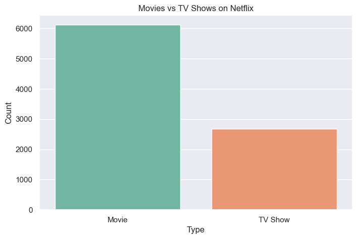
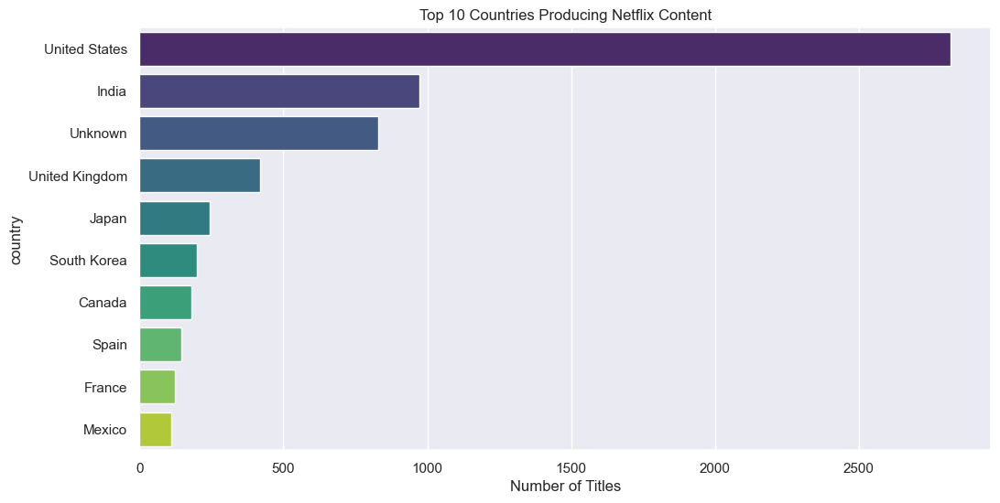
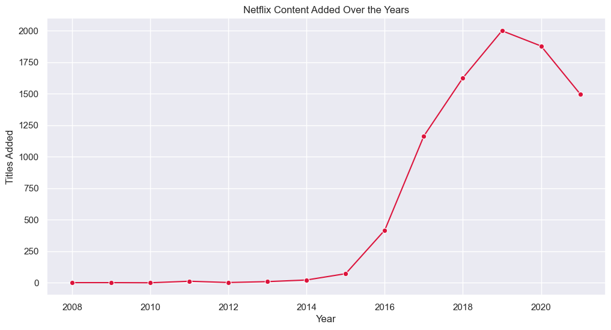
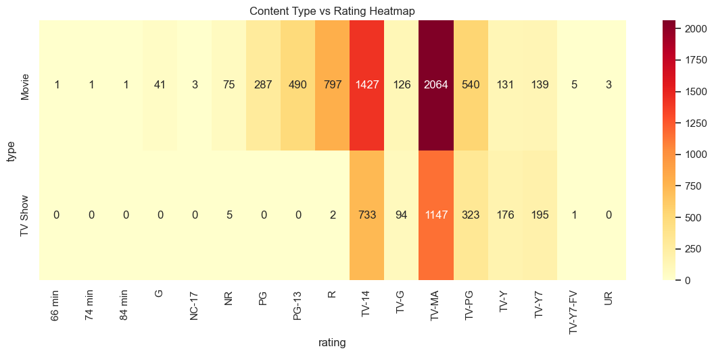

# 🎬 Netflix EDA — Exploratory Data Analysis


---

## 📌 Project Overview

This project performs **Exploratory Data Analysis (EDA)** on Netflix Movies & TV Shows dataset to uncover patterns, trends, and platform strategies.

---

## 📊 Key Insights 🔥

* 📌 Netflix has significantly more **Movies than TV Shows**, indicating a high-volume content strategy
* 📌 **TV-MA rating dominates**, showing focus on mature audience
* 📌 Rapid content growth observed between **2016–2019** (major expansion phase)
* 📌 **USA and India lead content production**, highlighting global + regional dominance
* 📌 Most movies fall in **80–120 minutes range**, optimized for viewer engagement

---

## 🖼️ Visualizations

### 🎥 Movies vs TV Shows


➡️ Netflix has significantly more movies than TV shows, indicating a content strategy focused on high-volume, quick-consumption content.

---

### 🌍 Top 10 Countries Producing Content


➡️ The United States leads content production by a large margin, followed by India, showing both global dominance and regional expansion.

---

### 📈 Content Growth Over Years


➡️ Content additions surged rapidly between 2016–2019, reflecting Netflix’s aggressive expansion phase.

---

### 🔥 Type vs Rating Heatmap


➡️ TV-MA dominates across both movies and TV shows, indicating a strong focus on mature audience content.
---

## 📂 Dataset

* Source: [Kaggle — Netflix Movies and TV Shows](https://www.kaggle.com/datasets/shivamb/netflix-shows)
* Rows: 8807
* Columns: 12

---

## 🛠️ Tech Stack

* Python
* Pandas
* Matplotlib
* Seaborn
* Jupyter Notebook (VS Code)

---

## 📁 Project Structure

```
netflix-eda/
├── data/
│   └── netflix_titles.csv
├── images/
│   └── (charts PNGs)
├── netflix_eda.ipynb
├── requirements.txt
└── README.md
```

---

## 🚀 How to Run

```bash
pip install pandas matplotlib seaborn jupyter
jupyter notebook netflix_eda.ipynb
```

---

## ⭐ Conclusion

This analysis highlights Netflix’s strategic focus on **global expansion, mature content, and movie-dominant catalog**, providing insights into how streaming platforms optimize engagement.

---

## 👩‍💻 Author

- **Namratha Dirsumilli**
- Artificial Intelligence & Data Science
- Vishnu Institute of Technology