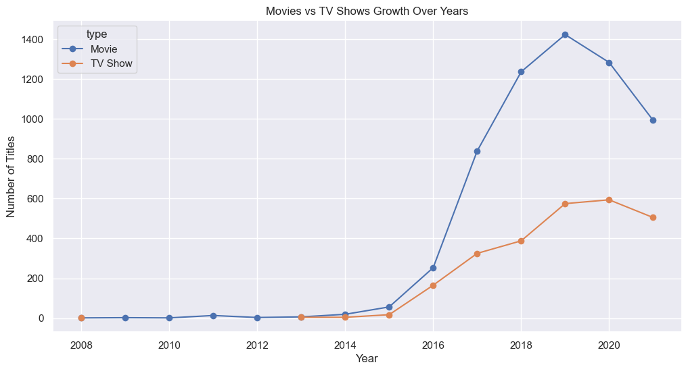

# 🎬 Netflix EDA — Exploratory Data Analysis


---

## 📌 Project Overview

This project performs Exploratory Data Analysis (EDA) on Netflix Movies & TV Shows dataset to uncover patterns, trends, and platform strategies.

---

## 🎯 Business Problem

Netflix needs to understand:

* What type of content drives engagement?
* Which regions contribute most content?
* What audience segment is targeted?

This analysis explores content distribution, growth trends, and rating patterns to support strategic decisions.

---

## 📊 Key Insights

* Netflix has significantly more Movies than TV Shows
* TV-MA rating dominates, indicating focus on mature audiences
* Rapid content growth between 2016–2019
* USA and India lead content production
* Most movies fall in 80–120 minutes range

---

## 🖼️ Visualizations

### 🎥 Movies vs TV Shows


➡️ Netflix has significantly more movies than TV shows, indicating a content-heavy strategy focused on quick consumption.

---

### 🌍 Top 10 Countries Producing Content


➡️ The United States dominates content production, followed by India, showing both global leadership and regional expansion.

---

### 📈 Content Growth Over Years


➡️ Content additions surged rapidly between 2016–2019, reflecting Netflix’s aggressive expansion phase.

---

### 🔥 Type vs Rating Heatmap


➡️ TV-MA dominates across both movies and TV shows, indicating strong focus on mature audience content.

---

### 📊 Movies vs TV Shows Trend (Advanced)



➡️ TV Shows have increased steadily after 2016, indicating Netflix’s shift towards long-form content.

---

## 🔍 Advanced Insights

* TV Shows saw significant growth after 2016, indicating increased investment in long-form content
* Netflix expanded globally with increasing international content
* Content strategy shifted from quantity to diversified categories

---

## 📂 Dataset

* Source: Kaggle — Netflix Movies and TV Shows
* Rows: 8807
* Columns: 12

---

## 🛠️ Tech Stack

* Python
* Pandas
* Matplotlib
* Seaborn
* Jupyter Notebook

---

## 📁 Project Structure

```
netflix-eda/
├── data/
├── images/
├── netflix_eda.ipynb
├── requirements.txt
└── README.md
```

---

## 🚀 How to Run

```bash
pip install pandas matplotlib seaborn jupyter
jupyter notebook netflix_eda.ipynb
```

---

## ⭐ Conclusion

This project highlights Netflix’s strategy of focusing on global expansion, mature content, and increasing investment in TV shows for long-term engagement.

---

## 👩‍💻 Author

- **Namratha Dirsumilli**
- Artificial Intelligence & Data Science
- Vishnu Institute of Technology